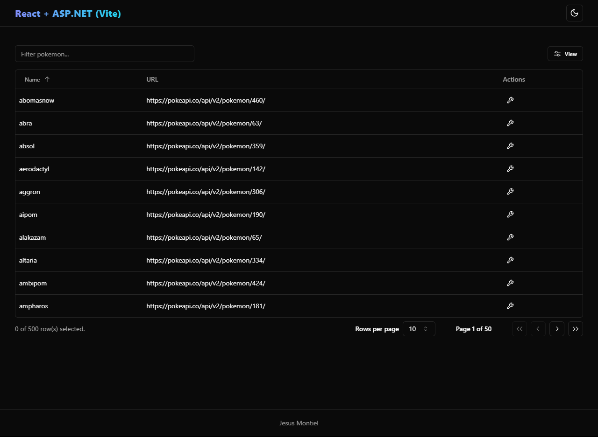
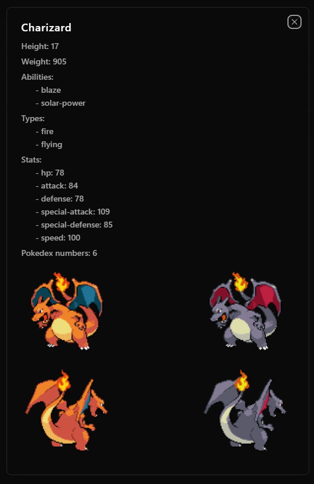

# ExternalAPIs

Just a project for testing out Net Core 7 with ASP.Net and the new project template with React made with Vite 5

Default page

Action Dialog

## Packages installed

All packages installed using oficial documentation

- tailwindcss
- shadcn-ui
- lucide-react icons
- tanstack table

## Setup

Switch from https to http in vite.config.ts
